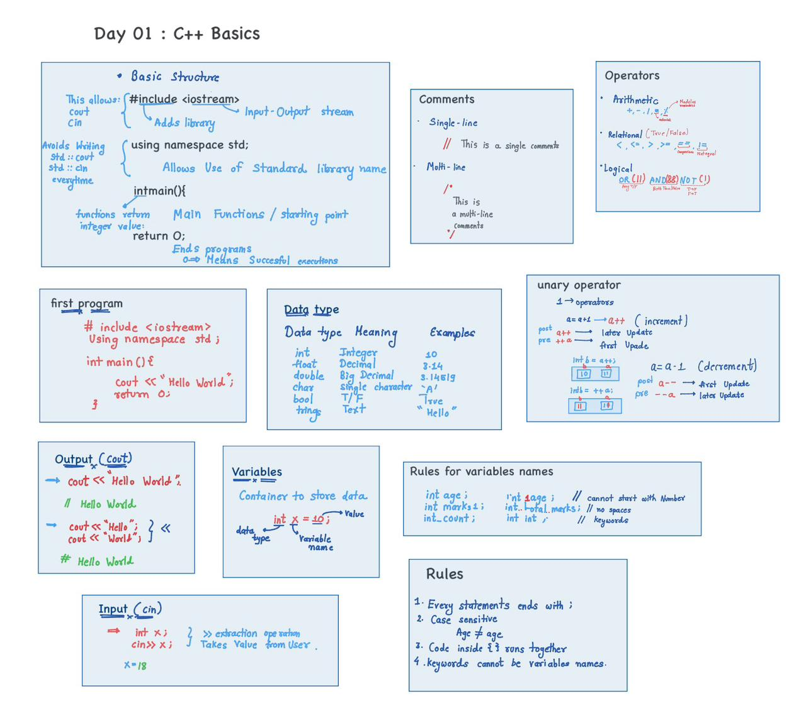

# Day 1 – C++ Basics

## 📒 Handwritten Notes

> These handwritten notes cover the fundamentals of C++ required to start DSA.





---

## Topics Covered

- Basic structure of a C++ program  
- `cin` and `cout`  
- Comments  
- Data types  
- Variables  
- Operators  
- Unary operators (pre & post increment/decrement)  
- Basic rules of C++ syntax  

---

## Goal of Day 1

 # 📘 Day 01: C++ Basics

This day focuses on **basic C++ programming concepts** required to start Data Structures and Algorithms (DSA).

The goal is to understand syntax, input/output, and simple logic building.
---

### 1.basic structure

### #include <iostream>
Includes the library needed for input (cin) and output (cout).

### using namespace std;
Allows using standard functions without writing std::.

### int main()
The main function is the starting point of execution.

{ }
Curly braces define the block of code.

# return 0;
Ends the program successfully.

---
## 2. Output in C++ (cout)

cout is used to print output on the screen.

**Example 1:**
```cpp
cout << "Hello World";
```
**Example 2:**
```cpp
int x = 10;
cout << x;

```
**Example(multiple outputs): **
```cpp(multiple outputs):
int a = 5, b = 10;
cout << a << " " << b;
```
---
⌨️ 3. Input in C++ (cin)

cin is used to take input from the user.

**Example :**
```cpp
int x;
cin >> x;
cout << x;
```
**Example :**
```cpp
int a, b;
cin >> a >> b;
cout << a + b;
```
---
## 4. Comments in C++

Comments are ignored by the compiler and used to explain code.
```cpp
Single-line comment:
// This is a comment
```
```cpp
Multi-line comment:
/*
This is a
multi-line comment
*/
```
---
## 5. Data Types in C++

Data types define the type of data a variable can store.

|Data Type	|Description|	Example|
|int|	Integer numbers	|10|
|float	|Decimal numbers|	3.14|
|double|	Large decimals|	3.14159|
|char|	Single character|	'A'
|bool	|True or False	|true|

**Example:**
```cpp
int age = 20;
float marks = 88.5;
char grade = 'A';
bool passed = true;
```
---
## 6. Variables

Variables are containers used to store data.
```cpp
Declaration:
int x;
Initialization:
int x = 10;
Update:
x = 20;
```
- Rules for Variable Names

- Must start with a letter or _

- Cannot start with a number

- No spaces allowed

- Keywords cannot be used

#Case-sensitive

✔ Valid: count, _sum, totalMarks
❌ Invalid: 1num, total marks, int

---

## 7. Operators in C++
🔹 Arithmetic Operators

Used for mathematical operations.

Operator	Meaning
+	Addition
-	Subtraction
*	Multiplication
/	Division
%	Modulus

**Example:**
```cpp
int a = 10, b = 3;
cout << a + b;   // 13
cout << a % b;   // 1
```
## Relational Operators

Used to compare values.

Operator	Meaning
==	Equal
!=	Not equal
<	Less than
>	Greater than
<=	Less than or equal
>=	Greater than or equal

**Example:**
```cpp
int a = 10, b = 20;
cout << (a < b);   // 1 (true)
```
##Logical Operators

Used to combine conditions.

Operator	Meaning
&&	AND
|| OR	
!	NOT

**Example:**
```CPP
int age = 20;
cout << (age >= 18 && age <= 25);
```
---

## 8.Unary Operators

Operate on a single variable.
```cpp
Increment:
int x = 5;
x++;   // x becomes 6
```
```
Decrement:
x--;   // x becomes 5
```
```
Pre vs Post Increment:
int a = 5;
cout << ++a;  // 6
cout << a++;  // 6 (then a becomes 7)

```


---


## 🧪 Programs Implemented

| No. | Program Name | Description |
|----|-------------|-------------|
| 1 | `01_hello_world.cpp` | Print "Hello World" using C++ |
| 2 | `02_input_output.cpp` | Taking input and displaying output |
| 3 | `03_operators.cpp` | Demonstration of basic operators |
| 4 | `04_even_odd.cpp` | Check whether a number is even or odd |
| 5 | `05_fizz_buzz.cpp` | Classic FizzBuzz problem |

---

## 🎯 Learning Outcome
- Understand basic C++ syntax
- Use `cin` and `cout` confidently
- Apply conditional logic
- Write and run simple C++ programs

---

## 🛠️ Tools Used
- Language: **C++**
- Compiler: **GCC (MinGW)**
- Editor: **VS Code**

---

## ✅ Status
✔️ Completed  
✔️ 5 programs implemented  
✔️ Code tested and committed


📌 *Part of my **30 Days of DSA** learning series.*
