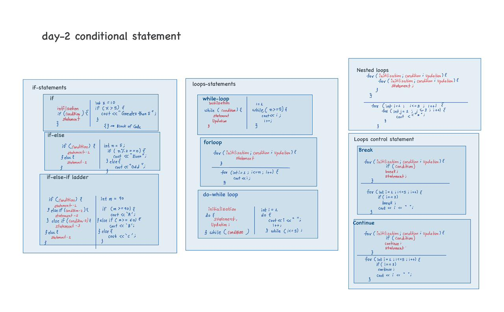

# Day 02 – Conditional Statements and Loops

---
## Day 02 Visual Notes




## 1. Conditional Statements

Conditional statements are used to make decisions in a program based on conditions.

---


### 1.1 if Statement

The `if` statement executes a block of code only when the condition is true.

**Syntax:**
```cpp
if (condition) {
    // statement
}

```

**example:**
```cpp
int x = 10;
if (x > 5) {
    cout << "Greater than 5";
}
```

### 1.2 if–else Statement

The `if–else` statement executes one block of code if the condition is true and another block if the condition is false.

**Syntax:**
```cpp
if (condition) {
    // statement 1
} else {
    // statement 2
}
```
**example:**
```cpp
int n = 5;
if (n % 2 == 0) {
    cout << "Even";
} else {
    cout << "Odd";
}
```
### 1.3 if–else–if Ladder

The `if–else–if` ladder is used to check multiple conditions.  
The first true condition is executed.

**Syntax:**
```cpp
if (condition1) {
    // statement 1
} else if (condition2) {
    // statement 2
} else {
    // statement
}
```
**example:**
```cpp
int marks = 90;
if (marks >= 90) {
    cout << "A";
} else if (marks >= 60) {
    cout << "B";
} else {
    cout << "C";
}

```

---


## 2.Loop Statements

### 2.1 while Loop

The while loop checks the condition before executing the loop body.
**Syntax:**
```cpp
initialization;
while (condition) {
    // statement
    // update
}
```
**example:**
```cpp
int i = 1;
while (i <= 5) {
    cout << i << " ";
    i++;
}
```
### 2.2 for Loop

The for loop is used when the number of iterations is known.

**Syntax:**
```
for (initialization; condition; update) {
    // statement
}
```
**example:**
```cpp
for (int i = 1; i <= 5; i++) {
    cout << i << " ";
}
```
### 2.3 do–while Loop

The do–while loop executes at least once because the condition is checked after execution.

**Syntax:**
```
initialization;
do {
    // statement
    // update
} while (condition);
```
**example:**
```cpp
int i = 1;
do {
    cout << i << " ";
    i++;
} while (i <= 5);
```
### 2.4 Nested Loops

A nested loop is a loop inside another loop.

**Syntax:**
```cpp
for (initialization; condition; update) {
    for (initialization; condition; update){
    // statement
    }
}
```
**example:**
```cpp
for (int i = 1; i <= 3; i++) {
    for (int j = 1; j <= 3; j++) {
        cout << i << " ";
    }
    cout << endl;
}
```
---


## 4. Loop Control Statements


###4.1 break Statement

The break statement terminates the loop immediately.
**example:**
```cpp
for (int i = 1; i <= 5; i++) {
    if (i == 3) {
        break;
    }
    cout << i << " ";
}
```
### 4.2 continue Statement

The continue statement skips the current iteration and moves to the next iteration.

**example:**
```cpp
for (int i = 1; i <= 5; i++) {
    if (i == 3) {
        continue;
    }
    cout << i << " ";
}
```

---


##Summary

- Learned conditional statements: `if`, `if–else`, `if–else–if`
- Learned loop statements: `while`, `for`, `do–while`
- Understood nested loops
- Used loop control statements: `break` and `continue`

## 🧪 Practice Questions – Day 02

Try to solve these problems using **conditional statements and loops**.  

| No. | Problem Statement | Concepts Used |
|----|------------------|---------------|
| 1 | Write a program to check whether a given number is **positive, negative, or zero**. | if–else |
| 2 | Write a program to check whether a given number is **even or odd**. | if–else |
| 3 | Write a program to print numbers from **1 to N** using a `for` loop. | for loop |
| 4 | Write a program to print the **sum of first N natural numbers**. | loop, variable |
| 5 | Write a program to print the **multiplication table** of a given number. | for loop |
| 6 | Write a program to **count the digits** in a given number. | while loop |
| 7 | Write a program to print numbers from **1 to 20**, but **skip multiples of 3** using `continue`. | loop, continue |

---


📌 End of Day 02


